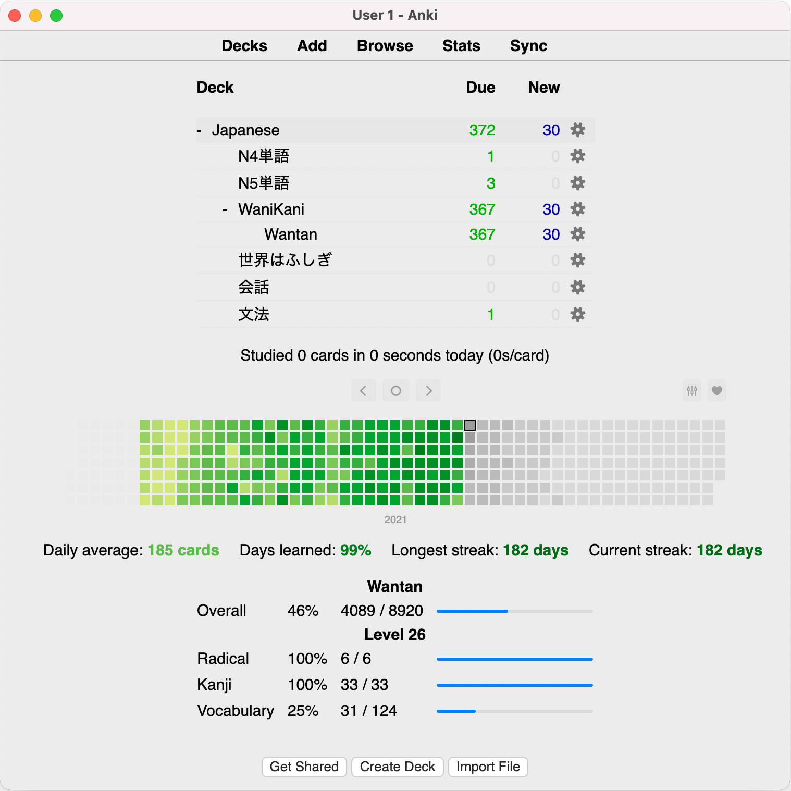

# Wantan Stats

This is a basic stats add-on for Anki. It requires the presence of a deck
created from content prepared by [wantan](https://github.com/zendikit/wantan).

This add-on does not modify any data, and it only adds a visual element to the
deck browser as shown at the bottom of the image below.

Remaining work is determined based solely on cards in the **new** state (so, if
you have seen a card already and have lapsed, that card will still be counted
as completed). Stats are for **cards** and not notes.

# Dependencies

This add-on is written for Anki 2.1.44+.

# Support

We wrote this for our own sake, and we share the code in case others find the
work useful. In general, we don't offer support for this add-on.

# Installation and Use

Locate your add-ons folder. For example, on macOS, it may be
`~/Library/Application Support/Anki2/addons21/`. Clone this repo into your
addons folder. (We don't distribute this add-on on AnkiWeb.)

In `wantan/config.json`, change `full_deck_name` to the fully-qualified name
of your deck created with content from the `wantan` tool. For example, in
the screenshot above, the name is `Japanese::WaniKani::Wantan`.

# Known Issues

Most errors are not handled gracefully.

This add-on will crash if you have no "new" cards remaining in your wantan deck,
but at that point, you won't need this add-on anymore :)

# License

MIT license.
